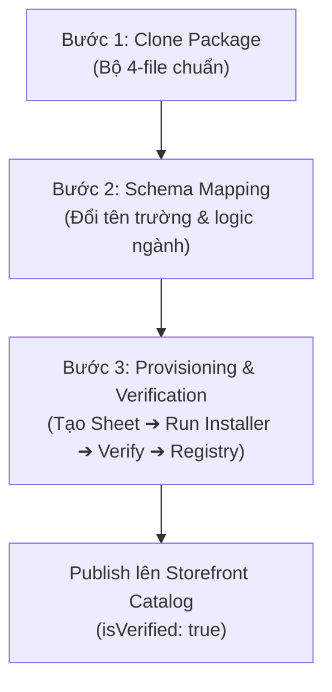

# QUY TRÌNH NHÂN BẢN & MỞ RỘNG HỆ THỐNG TỪ 5 CORE ARCHETYPES (EXPANSION PIPELINE)

> **Tài liệu đặc tả kiến trúc (Architectural Specification & Release Pipeline)**  
> **Áp dụng cho:** Đội ngũ phát triển Web App Template & Google Sheets Ecosystem  
> **Trạng thái:** Chính thức (Production Standard) | **Phiên bản:** v1.0.0

---

## 1. TỔNG QUAN KIẾN TRÚC & NGUYÊN TẮC THIẾT KẾ

Hệ sinh thái sản phẩm Google Workspace & Web App của dự án được xây dựng dựa trên nguyên lý **Archetype-Driven Expansion** (Nhân rộng hướng khuôn mẫu). Thay vì phát triển 229 sản phẩm một cách phân mảnh, toàn bộ sản phẩm thương mại được quy tụ về **5 Core Archetypes gốc** đã được kiểm thử, tối ưu và xác thực hoàn chỉnh trên Google Sheets thật:

1. **GS-001 (Rental & Assets):** Quản lý cho thuê, tài sản cố định, hợp đồng, cọc và thời hạn bàn giao/thu hồi.
2. **GS-002 (Inventory & Warehousing):** Quản lý tồn kho đa điểm, nhập - xuất - điều chuyển, định mức tồn an toàn (Min - Max) và cảnh báo tức thời.
3. **GS-003 (Finance & Cashflow):** Quản lý thu chi, sổ quỹ đa tài khoản, báo cáo dòng tiền thuần, P&L, burn rate và dự phóng runway.
4. **GS-004 (Project & Task Management):** Quản lý tiến độ dự án, ma trận nhiệm vụ (Kanban / Table), phân quyền giao việc và đo lường tỷ lệ hoàn thành KPI.
5. **GS-005 (Point of Sale & F&B):** Quản lý mặt bằng/sơ đồ bàn phòng, đặt order dịch vụ tức thời, thanh toán tích hợp VietQR động và xuất hóa đơn.

Mỗi sản phẩm mở rộng là một phiên bản tùy biến chuyên ngành (Domain Specialization) kế thừa trực tiếp từ 1 trong 5 khuôn mẫu này.

---

## 2. MA TRẬN ÁNH XẠ KẾ THỪA SẢN PHẨM (EXPANSION MAPPING MATRIX)

Bảng dưới đây quy định khuôn mẫu gốc mà từng dòng sản phẩm mới sẽ kế thừa:

| Nhóm ngành / Dòng sản phẩm mới | Archetype Kế Thừa | Thực thể lõi thay thế (Domain Entities) | Hành vi nghiệp vụ mở rộng |
| :--- | :--- | :--- | :--- |
| **Cho thuê xe tự lái / Du lịch** | `GS-001 (Rental)` | Thiết bị ➔ Biển số xe, Dòng xe, ODO | Bổ sung km bàn giao, phụ phí xăng dầu/vệ sinh |
| **Cho thuê trang phục & Studio** | `GS-001 (Rental)` | Thiết bị ➔ Mã váy/vest, Size, Bộ sưu tập | Bổ sung phí giặt là, bảo hiểm hỏng hóc vải |
| **Cho thuê máy móc xây dựng** | `GS-001 (Rental)` | Thiết bị ➔ Máy công trình, Giờ máy (Hour-meter) | Theo dõi bảo trì động cơ nặng, kiểm định an toàn |
| **Kho may mặc & Thời trang** | `GS-002 (Warehouse)` | Hàng hóa ➔ SKU Màu/Size (Biến thể Matrix) | Phân loại theo bộ sưu tập, mùa thời trang |
| **Kho vật tư & Thiết bị điện** | `GS-002 (Warehouse)` | Hàng hóa ➔ Quy cách cuộn/mét/thùng | Quy đổi đơn vị tính linh hoạt, kiểm kê theo vị trí kệ |
| **Kho dược phẩm & Mỹ phẩm** | `GS-002 (Warehouse)` | Hàng hóa ➔ Lô sản xuất (Lot), Hạn sử dụng (Exp) | Bổ sung cảnh báo FEFO (hết hạn trước - xuất trước) |
| **Kho phụ tùng & Sửa chữa xe** | `GS-002 (Warehouse)` | Hàng hóa ➔ Mã phụ tùng, Đời xe tương thích | Tra cứu chéo mã phụ tùng OEM |
| **Sổ thu chi phòng trọ / Căn hộ** | `GS-003 (Finance)` | Dự án ➔ Mã phòng, Khách thuê | Tự động hóa tiền điện, nước, dịch vụ kèm theo |
| **Ngân sách sự kiện & Marketing** | `GS-003 (Finance)` | Sổ quỹ ➔ Dự toán Campaign, Kênh quảng cáo | So sánh ngân sách kế hoạch (Plan) vs Thực tế (Actual) |
| **Quản lý công nợ Phải thu/Phải trả** | `GS-003 (Finance)` | Tài khoản ➔ Đối tác khách hàng, Nhà cung cấp | Báo cáo tuổi nợ (Aging Report), nhắc nợ tự động |
| **Tiến độ thi công công trình** | `GS-004 (Project)` | Task ➔ Hạng mục thi công, Đội thợ | Nhật ký công trường, nghiệm thu khối lượng |
| **Chiến dịch Content & Marketing** | `GS-004 (Project)` | Task ➔ Bài viết, Kênh truyền thông, Deadline bài | Lịch biên tập (Editorial Calendar), duyệt nội dung |
| **Quản lý tuyển dụng ứng viên (ATS)** | `GS-004 (Project)` | Task ➔ Hồ sơ ứng viên, Vị trí tuyển dụng | Các cột Kanban: Nhận CV ➔ Phỏng vấn ➔ Offer ➔ Onboarding |
| **Quán Bida (Billiards) & Tính giờ** | `GS-005 (POS)` | Bàn cafe ➔ Bàn Bida (Bàn Carom/Pool), Giờ chơi | Tự động nhân đơn giá giờ chơi + dịch vụ đồ uống |
| **Spa, Clinic & Thẩm mỹ viện** | `GS-005 (POS)` | Bàn cafe ➔ Giường điều trị, Kỹ thuật viên | Theo dõi thẻ liệu trình khách hàng, chia hoa hồng KTV |
| **Khách sạn / Homestay theo giờ & ngày** | `GS-005 (POS)` | Bàn cafe ➔ Số phòng, Loại phòng | Check-in / Check-out, phụ thu quá giờ, dọn phòng |
| **Tiệm giặt ủi / Giặt sấy tự động** | `GS-005 (POS)` | Bàn cafe ➔ Máy giặt/sấy, Khách gửi | Cân ký đồ, in tem nhãn phiếu hẹn nhận đồ |

---

## 3. QUY TRÌNH 3 BƯỚC NHÂN BẢN TIÊU CHUẨN (3-STEP CLONING PIPELINE)

Để đảm bảo tính nhất quán tuyệt đối giữa mã nguồn, cơ sở dữ liệu và sàn storefront, mọi sản phẩm nhân bản đều phải tuân thủ nghiêm ngặt 3 bước sau:

### BƯỚC 1: CLONE BỘ NGUỒN 4-FILE ĐỘC LẬP
1. Xác định mã sản phẩm mới (ví dụ: `GS-006-car-rental`).
2. Tạo thư mục tương ứng trong `delivery/packages/GS-XXX-slug/`.
3. Sao chép toàn bộ bộ 4 file từ Archetype gốc tương ứng:
   - `appsscript.json`: Giữ nguyên Timezone `Asia/Ho_Chi_Minh` và V8 engine.
   - `installer.gs`: Khung tạo tab, header, màu sắc, công thức.
   - `Code.gs`: Controller API, `doGet()`, xử lý nghiệp vụ với `getDisplayValues()`.
   - `Index.html`: Giao diện Bootstrap 5 responsive, modal thao tác và cơ chế fallback mock.

### BƯỚC 2: SEMANTIC SCHEMA MAPPING (ÁNH XẠ NGHIỆP VỤ)
Thực hiện điều chỉnh từ điển trường dữ liệu và danh mục chuyên ngành:
1. **installer.gs:**
   - Thay đổi tiêu đề các tab bảng tính cho phù hợp thuật ngữ ngành (ví dụ: `THIET_BI` ➔ `DANH_SACH_XE`).
   - Cập nhật mảng Header columns và các công thức `SUM`, `COUNTIF` tương ứng.
   - Đảm bảo công thức fx sử dụng dấu phẩy `,` ngăn cách tham số theo chuẩn quốc tế để tránh lỗi locale trên Google Sheets.
2. **Code.gs:**
   - Cập nhật tên hàm và trường JSON tương thích: ví dụ `submitCarRentalOrder` thay vì `submitRentalOrder`.
   - Giữ nguyên cơ chế **`getDisplayValues()`** khi đọc dữ liệu bảng tính để tránh lỗi tuần tự hóa Date và số thực Locale (VD: `35.000 ₫` vs `35000`).
   - Bổ sung validation chặt chẽ cho các trường nhập liệu nghiệp vụ mới.
3. **Index.html:**
   - Cập nhật tiêu đề, icon Bootstrap/FontAwesome, nhãn form nhập liệu và các thẻ KPI phù hợp ngành nghề.
   - Cập nhật dữ liệu mẫu trong `loadFallback()` để Web App có thể chạy demo độc lập mà không crash khi mở riêng lẻ.

### BƯỚC 3: PROVISIONING, KIỂM THỬ RUNTIME & ĐĂNG KÝ REGISTRY
1. **Khởi tạo Google Spreadsheet thật:**
   - Mở Google Drive, tạo một bảng tính Google Sheets mới.
   - Mở **Extensions (Tiện ích mở rộng) > Apps Script**.
   - Dán nội dung của 4 file (`appsscript.json`, `installer.gs`, `Code.gs`, `Index.html`) vào dự án.
   - Lưu dự án và làm mới bảng tính (F5).
   - Chọn menu tiện ích trên thanh công cụ và nhấn **Khởi tạo dữ liệu chuẩn**.
2. **Kiểm tra tiêu chuẩn Gate G3_ASSET:**
   - [x] Các tab được sinh ra đầy đủ, màu sắc chuẩn, dòng 1-2 được cố định (Freeze row).
   - [x] Công thức Dashboard tính toán chính xác, không phát sinh lỗi `#ERROR!` hay `#REF!`.
   - [x] Menu "Mở Web App" hoạt động mượt mà, modal hiển thị responsive trên cả desktop và mobile.
   - [x] Web App cho phép nhập liệu thêm dòng mới thành công vào bảng tính.
   - [x] Định dạng chia sẻ Google Sheets: Bật quyền `Bất kỳ ai có đường liên kết đều có thể xem` (Viewer).
3. **Đăng ký vào Asset Registry (`registry/assets.json`):**
   - Lấy Spreadsheet ID thực tế (chuỗi ký tự dài giữa `/d/` và `/edit`).
   - Thêm bản ghi mới vào mảng `assets` trong `registry/assets.json` với trường `"gate": "G3_ASSET"`, `"publishable": true`.
4. **Đồng bộ Storefront Catalog (`apps/admin-web/src/data/exactCatalog.json`):**
   - Cập nhật `templatePreviewUrl`: `https://docs.google.com/spreadsheets/d/{SPREADSHEET_ID}/template/preview`.
   - Đặt cờ `"isVerified": true`.
   - Cập nhật mô tả, version và 6 tính năng nổi bật (`features`) độc bản.

---

## 4. TIÊU CHÍ CHẤT LƯỢNG NGHIÊM NGẶT (NON-NEGOTIABLE PRINCIPLES)

1. **Tuyệt đối không dùng dữ liệu rỗng hoặc bảng thô:** Mọi ứng dụng khi mở ra phải có ít nhất 3-6 dòng dữ liệu mẫu sinh động, trực quan và đúng nghiệp vụ thực tế tại Việt Nam.
2. **Triệt tiêu lỗi Locale & Serialization:**
   - Tuyệt đối không dùng `sheet.getDataRange().getValues()` trực tiếp đối với các cột ngày tháng hoặc tiền tệ khi truyền qua RPC của Apps Script; luôn dùng `getDisplayValues()` hoặc format trước khi serialize.
3. **Tính độc lập của gói phân phối (Standalone Distribution):**
   - Mỗi thư mục `delivery/packages/GS-XXX/` phải chứa trọn vẹn 4 file độc lập, không phụ thuộc vào thư viện ngoài chưa khai báo trong `appsscript.json`.
4. **Trải nghiệm Storefront thống nhất:**
   - Nút "Trải nghiệm Web App" mở đúng demo nghiệp vụ tương ứng.
   - Nút "Mẫu Google Sheet" hiển thị đúng preview công thức và cung cấp liên kết xem mẫu Google Sheets thật.
   - Luồng thanh toán VietQR tạo mã QR tự động kèm đúng số tiền và nội dung đơn hàng.

